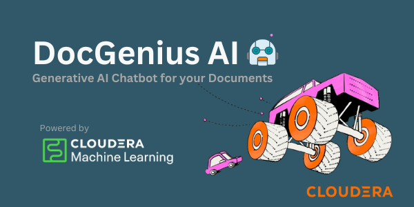
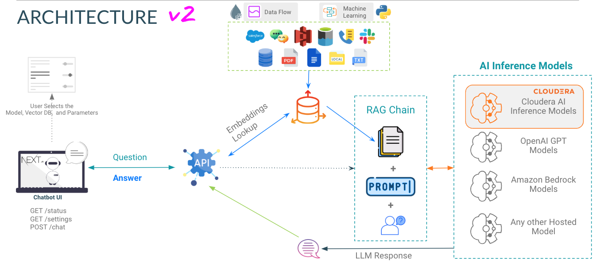
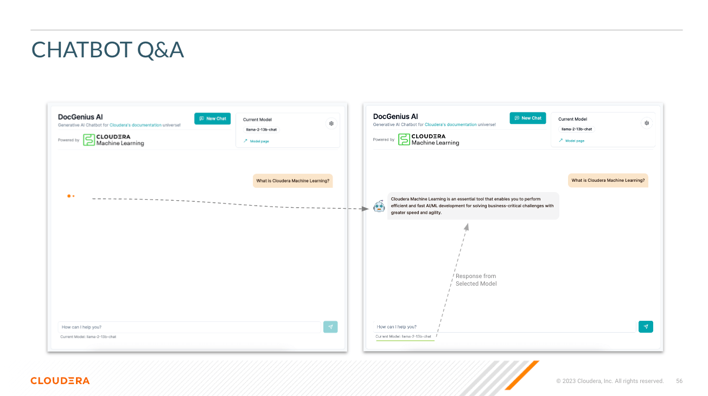
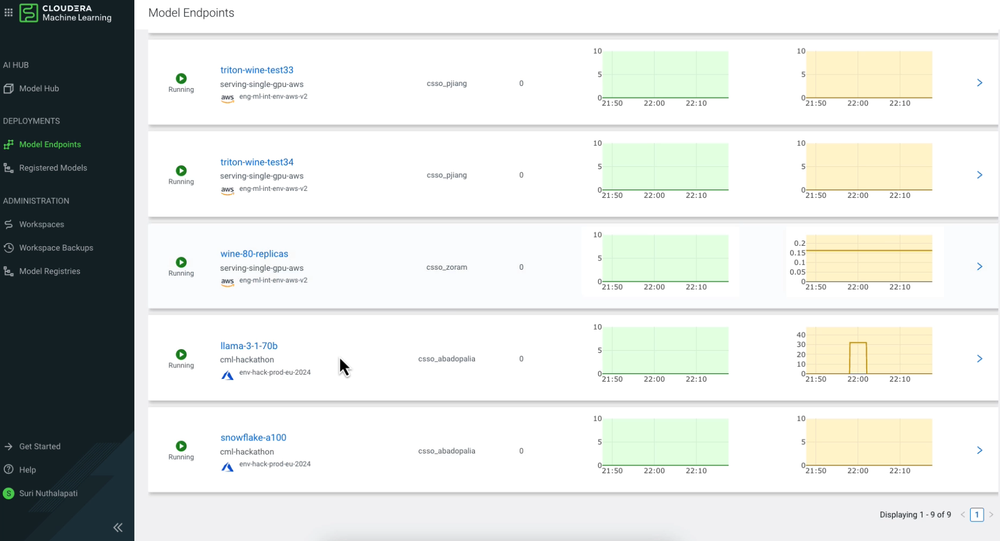
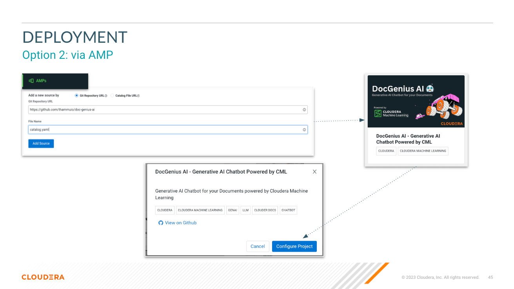
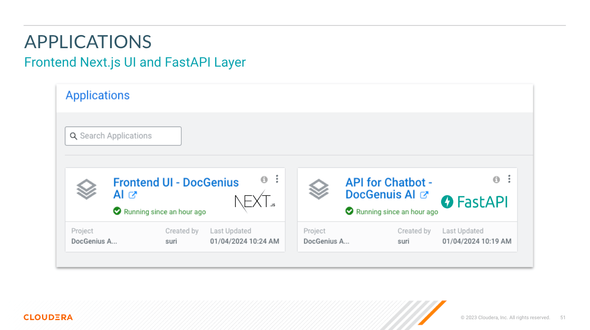

# DocGenius AI - Generative AI Chatbot for your Documents
<p align="center">
  
</p>

## Architecture
<p align="center">
  
</p>


## Chatbot with RAG Implementation
<p align="center">
  
</p>

<p align="center">
  
</p>

## Cloudera AI Inference
<p align="center">
  
</p>

## Deployment
### Cloudera AMP
<p align="center">
  
</p>

### Applications
<p align="center">
  
</p>


## Building your custom knowledge base
- Use Vector DB
- Use NiFi
- Use Python & more..

## Understanding the User Inputs and Output

### Inputs
**Select Model** - Here the user can select the Llama3 70B parameter chat model (`llama-3-70b`)

**Select Temperature (Randomness of Response)** - Here the user can scale the randomness of the model's response. Lower numbers ensure a more approximate, objective answer while higher numbers encourage model creativity.

**Select Number of Tokens (Length of Response)** - Here several options have been provided. The number of tokens the user uses directly correlate with the length of the response the model returns.

**Question** - Just as it sounds; this is where the user can provide a question to the model

### Outputs
**Response** - This is the response generated by the model given the context in your vector database. Note that if the question cannot correlate to content in your knowledge base, you may get hallucinated responses.


## Deployment

### FastAPI for LLMs
`app` directrory hosts the FastAPI for your LLMs 

### Chatbot UI (Front end)
`chat-ui` directrory hosts the code for Chatbot UI.

### Variables
Look at [Variables](.env.example) when Deploying the AMP. Refer [Cloduera AI Inference](https://www.cloudera.com/products/machine-learning/ai-inference-service.html) Docs to Get Inference endpoint and Key.

## Requirements
#### CML Instance Types
- A GPU instance is required to perform inference on the LLM
  - [CML Documentation: GPUs](https://docs.cloudera.com/machine-learning/cloud/gpu/topics/ml-gpu.html)
- A CUDA 5.0+ capable GPU instance type is recommended *(This will fail on Step 2 if this requirement is not met)*
  - The torch libraries in this require a GPU with CUDA compute capability 5.0 or higher. (i.e. NVIDIA V100, A100, T4 GPUs)

#### Recommended Runtime
JupyterLab - Python 3.11 - Nvidia GPU

#### AMP Docs
https://docs.cloudera.com/machine-learning/cloud/applied-ml-prototypes/topics/ml-amp-project-spec.html

#### Resource Requirements
This creates the following workloads with resource requirements:
- CML Session: `2 CPU, 16GB MEM`
- CML Jobs: `2 CPU, 8GB MEM`
- CML Application: `2 CPU, 1 GPU, 16GB MEM`

#### Default KnowledgeBase
- When this AMP is deployed it will deploy a sample job to build Knowledgebase with Local Milvus from the [Retail Data set](data/retail_kb).

# Code Structure
```
doc-genius-ai/
├── app/                      	# Application directory for API and Model Serving
│   └── [..subdirs..]
│   └── chatbot/		# has the model serving python files for RAG, Prompt, Fine-tuning models
│   └── main.py		# main.py file to start the API
├── chat-ui/                  	# Directory for the chatbot UI in Next.js
│   └── [..subdirs..]
│   └── app.py 		# app.py file to serve  build files in .next directory via Flask
├── pipeline/                 	# Pipeline directory for data processing or workflow pipelines and vector load
├── data/                     	# Data directory for storing datasets or data files or RAG KB
├── models/                   	# Models directory for LLMs / ML models
├── session/                  	# Scripts for CML Sessions and Validation Tasks
├── images/                   	# Directory for storing project related images
├── api.md                    	# Documentation for the APIs
├── README.md         	# Detailed description of the project
├── .gitignore                	# Specifies intentionally untracked files to ignore
├── catalog.yaml          	# YAML file that contains descriptive information and metadata for the displaying the AMP projects in the CML Project Catalog.           
├─ .project-metadata.yaml    # Project metadata file that provides configuration and setup details
├── cdsw-build.sh             	# Script for building the Model dependencies
└── requirements.txt          	# Python dependencies for Model Serving
```

# Interim Fixes
1. Increase Ephemeral Storage Limit by navigating to CML Workspace -> Site Administration -> Settings -> Ephemeral Storage (in GB) and set it to a value >= 50
  - When a CML model is created, the model is loaded in the scratch space of a pod, LLM models are larger than the default 10 GB which causes issues during deployment.

2. Site Administration > Security > Allow applications to be configured with unauthenticated access. (Check the box)


# IMPORTANT NOTICE
**IMPORTANT:** Please read the following before proceeding. This AMP includes or otherwise depends on certain third party software packages. Information about such third party software packages are made available in the notice file associated with this AMP. By configuring and launching this AMP, you will cause such third party software packages to be downloaded and installed into your environment, in some instances, from third parties' websites. For each third party software package, please see the notice file and the applicable websites for more information, including the applicable license terms.

**If you do not wish to download and install the third party software packages, do not configure, launch or otherwise use this AMP. By configuring, launching or otherwise using the AMP, you acknowledge the foregoing statement and agree that Cloudera is not responsible or liable in any way for the third party software packages.**

Copyright (c) 2024 - Cloudera, Inc. All rights reserved.
